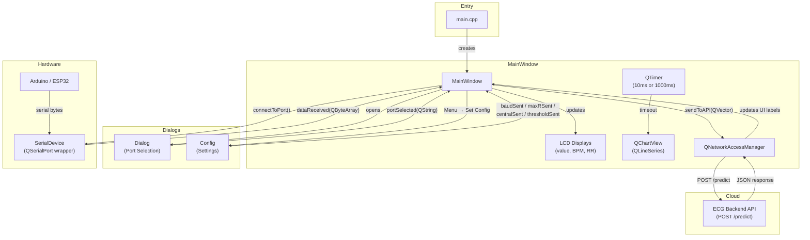

# WireFlux — Complete Technical Documentation

> **Version**: 2.0 (ECG Mode + ML API Integration)
> **Framework**: Qt 6.5+ (C++17)
> **Qt Modules**: Core · Widgets · SerialPort · Charts · Network

---

## Table of Contents

1. [Project Overview](#project-overview)
2. [Architecture](#architecture)
3. [File Inventory](#file-inventory)
4. [Module Reference](#module-reference)
   - [main.cpp — Application Entry Point](#maincpp--application-entry-point)
   - [SerialDevice — Serial Port Abstraction](#serialdevice--serial-port-abstraction)
   - [MainWindow — Core Application Controller](#mainwindow--core-application-controller)
   - [Dialog — Port Selection Dialog](#dialog--port-selection-dialog)
   - [Config — Configuration Dialog](#config--configuration-dialog)
5. [Data Pipeline](#data-pipeline)
6. [Real-Time Graphing Engine](#real-time-graphing-engine)
7. [ECG Mode](#ecg-mode)
8. [ML API Integration](#ml-api-integration)
9. [Peak Detection & BPM Calculation](#peak-detection--bpm-calculation)
10. [Configuration System](#configuration-system)
11. [UI Layout Reference](#ui-layout-reference)
12. [Signal-Slot Map](#signal-slot-map)
13. [Build System](#build-system)
14. [Deployment](#deployment)
15. [Known Limitations & Future Work](#known-limitations--future-work)

---

## Project Overview

**WireFlux** is a Qt 6 desktop application designed for real-time serial data monitoring and ECG (electrocardiogram) analysis. It connects to microcontroller boards (Arduino, ESP32, etc.) via serial port, ingests newline-delimited numeric samples, and renders a live scrolling chart.

### Key Capabilities

| Feature | Description |
|---|---|
| **Serial Monitoring** | Auto-discovers ports, configurable baud rate, newline-delimited protocol |
| **Real-Time Graphing** | QtCharts-based live plot with auto-scaling axes and point trimming |
| **Buffer Mode** | Batch-plots all buffered samples per tick for high-frequency data |
| **ECG Mode** | Optimized 125 Hz rendering at ~8 ms per sample, paper-speed proportional display |
| **Peak Detection** | Threshold-based R-peak detector with hysteresis for heart rate calculation |
| **BPM Calculation** | Rolling 5-beat average of beats-per-minute derived from RR intervals |
| **ML Classification** | Sends 200-sample ECG buffers to a remote API for Normal/Abnormal classification |
| **Configuration** | Runtime-adjustable baud rate, Y-axis range, central value, and ECG threshold |

---

## Architecture

```
┌─────────────────────────────────────────────────────────────────┐
│                        QApplication                             │
│  (main.cpp — dark theme stylesheet, event loop)                 │
├─────────────────────────────────────────────────────────────────┤
│                         MainWindow                              │
│  ┌───────────┐  ┌───────────┐  ┌──────────┐  ┌──────────────┐  │
│  │SerialDevice│  │ QChartView│  │ QTimer   │  │NetworkManager│  │
│  │(serial I/O)│  │(live plot)│  │(graph    │  │(ECG API POST)│  │
│  └─────┬─────┘  └─────┬─────┘  │ refresh) │  └──────┬───────┘  │
│        │               │        └────┬─────┘         │          │
│        │  dataReceived  │   timeout   │    sendToAPI  │          │
│        └───────►────────┴─────────────┘──────────────►┘          │
├─────────────────────────────────────────────────────────────────┤
│  Dialog (port picker)        Config (baud/range/threshold)      │
└─────────────────────────────────────────────────────────────────┘
```

### Signal Flow Diagram



---

## File Inventory

| File | Type | Purpose |
|---|---|---|
| `CMakeLists.txt` | Build | CMake project definition; links Qt6 Core, Widgets, SerialPort, Charts, Network |
| `main.cpp` | Source | Application entry point; applies global dark theme stylesheet |
| `mainwindow.h` | Header | MainWindow class declaration with all member variables and slots |
| `mainwindow.cpp` | Source | Core application logic: serial handling, graphing, ECG, API calls |
| `mainwindow.ui` | UI | Qt Designer layout for the main window |
| `serialdevice.h` | Header | SerialDevice class declaration; signal/slot interface |
| `serialdevice.cpp` | Source | Serial port wrapping: discovery, connect, disconnect, data parsing |
| `dialog.h` | Header | Dialog class declaration for port selection |
| `dialog.cpp` | Source | Port enumeration and user selection logic |
| `dialog.ui` | UI | Qt Designer layout for the port selection dialog |
| `config.h` | Header | Config class with default constants and signals |
| `config.cpp` | Source | Configuration form logic: save, revert to defaults, initial value loading |
| `config.ui` | UI | Qt Designer layout for the configuration dialog |
| `resources.qrc` | Resource | Embeds `E.png` at `:/images/E.png` |
| `E.png` | Asset | Application logo/icon image |

| `.gitignore` | Config | Git ignore rules for build artifacts, IDE metadata, macOS files |
| `README.md` | Docs | User-facing project overview and setup instructions |
| `DOCUMENTATION.md` | Docs | This file — full technical documentation |

---

## Module Reference

### `main.cpp` — Application Entry Point

**Lines**: ~101 | **Role**: Bootstrap

```
main(argc, argv)
  → QApplication created
  → Global dark theme stylesheet applied (raw string literal)
  → MainWindow instantiated and shown
  → Event loop started (a.exec())
```

#### Dark Theme Details

The application-wide stylesheet sets a premium dark UI using these design tokens:

| Element | Background | Border | Accent |
|---|---|---|---|
| Base widget | `#1A1A24` | — | — |
| Group boxes | `#232330` | `#3A3A4A` | — |
| Buttons | `#2D2D3B` | `#3A3A4A` | `#00A8E8` (pressed) |
| Inputs | `#12121A` | `#3A3A4A` | `#00A8E8` (focus) |
| Status bar | `#12121A` | — | `#A0A0B0` (text) |
| LCD numbers | `#12121A` | `#3A3A4A` | `#00A8E8` (digits) |

---

### `SerialDevice` — Serial Port Abstraction

**Files**: `serialdevice.h`, `serialdevice.cpp`
**Base class**: `QObject`
**Wraps**: `QSerialPort`

#### Public Interface

| Method | Signature | Description |
|---|---|---|
| **Constructor** | `SerialDevice(QObject *parent)` | Creates internal `QSerialPort`, connects `readyRead` → `handleReadyRead()` |
| **availablePorts** | `QStringList availablePorts() const` | Queries OS via `QSerialPortInfo::availablePorts()` |
| **connectToPort** | `bool connectToPort(const QString &portName, int baudRate = 9600)` | Closes existing connection (if open), sets port name + baud, opens ReadOnly |
| **disconnectPort** | `void disconnectPort()` | Closes the serial port if open, emits `deviceDisconnected` |

#### Signals

| Signal | Payload | When |
|---|---|---|
| `deviceConnected` | `QString portName` | Port successfully opened |
| `deviceDisconnected` | — | Port closed |
| `dataReceived` | `QByteArray data` | Complete newline-delimited packet reconstructed |
| `errorOccurred` | `QString error` | `QSerialPort::open()` failure |

#### Data Reconstruction Algorithm (`handleReadyRead`)

```
while (serial->canReadLine()):
    line = serial->readLine()
    if not empty:
        emit dataReceived(line)
```

> **Design Note**: Uses `canReadLine()` loop to handle fragmented serial reads. Only emits when a complete newline-terminated line is available, preventing partial-data parsing errors.

---

### `MainWindow` — Core Application Controller

**Files**: `mainwindow.h`, `mainwindow.cpp`, `mainwindow.ui`
**Base class**: `QMainWindow`
**Role**: Central hub connecting serial I/O, charting, ECG processing, and API communication

#### Member Variables

| Variable | Type | Default | Purpose |
|---|---|---|---|
| `ui` | `Ui::MainWindow*` | — | Auto-generated UI pointer |
| `serialDevice` | `SerialDevice*` | — | Serial port manager |
| `latestValue` | `int` | `0` | Most recently parsed integer sample |
| `series` | `QLineSeries*` | — | Chart data series |
| `axisX` | `QValueAxis*` | — | X-axis (Time in seconds) |
| `axisY` | `QValueAxis*` | — | Y-axis (Sample value) |
| `graphTimer` | `QTimer*` | — | Controls graph refresh rate |
| `currentTime` | `double` | `0.0` | Elapsed virtual time in seconds |
| `maxY` | `int` | `10` | Dynamic Y-axis upper bound |
| `centralR` | `int` | `0` | Central reference value for Y-axis |
| `windowXSpan` | `double` | `10.0` | Visible X-axis window width (seconds) |
| `dataBuffer` | `QVector<int>` | — | Incoming samples queued between graph ticks |
| `bufferMode` | `bool` | `false` | Whether buffer plotting is enabled |
| `mlBuffer` | `QVector<float>` | — | Rolling/recording buffer for ML API (200 samples) |
| `BUFFER_SIZE` | `const int` | `200` | Required sample count for API submission |
| `isRecording` | `bool` | `false` | Whether ECG recording is actively capturing |
| `isSaved` | `bool` | `false` | Flag for save state tracking |
| `BaudValue` | `int` | `9600` | Active baud rate for serial connections |
| `selectedPortName` | `QString` | `""` | Currently selected port identifier |
| `apiUrl` | `QString` | `https://ecgbackend.onrender.com/predict` | ECG classification endpoint |
| `healthUrl` | `QString` | `https://ecgbackend.onrender.com/` | API health check endpoint |
| `isApiBusy` | `bool` | `false` | Guards against concurrent API requests |
| `threshold` | `int` | `580` | R-peak detection threshold (ADC units) |
| `manager` | `QNetworkAccessManager*` | — | HTTP client for API calls |
| `rising` | `bool` | `false` | Peak detection state (ascending edge) |
| `lastPeakTime` | `qint64` | `0` | Timestamp of last detected R-peak (ms since epoch) |
| `bpmHistory` | `QVector<float>` | — | Rolling window of last 5 BPM values for averaging |

#### Slot Reference

| Slot | Trigger | Behavior |
|---|---|---|
| `on_btnConnectionToggle_clicked()` | "Turn On/Off" button | Connects to selected (or first available) port / disconnects |
| `on_btnSelectPort_clicked()` | "Select Port" button | Opens `Dialog`, binds `portSelected` signal |
| `onPortSelected(QString)` | Dialog selection | Sets port, attempts connection, updates UI |
| `onDataReceived(QByteArray)` | SerialDevice signal | Parses int, feeds graph buffer + ML buffer, runs peak detection |
| `on_btnBufferToggle_clicked()` | "Buffer Mode" button | Toggles `bufferMode` flag, updates button style |
| `on_actionSet_Config_triggered()` | Menu → Set Config | Opens `Config` dialog, binds config signals |
| `on_ecgModeButton_clicked()` | "ECG Mode" button | Toggles between normal (1 Hz) and ECG (100 Hz) graph modes |
| `on_ecgRec_clicked()` | "ECG Recording" button | Starts/stops ML buffer recording for API submission |
| `sendToAPI(QVector<float>)` | Internal call | POSTs 200-sample payload to ECG backend, updates result labels |

---

### `Dialog` — Port Selection Dialog

**Files**: `dialog.h`, `dialog.cpp`, `dialog.ui`
**Base class**: `QDialog`

| Method | Description |
|---|---|
| **Constructor** | Creates own `SerialDevice` to enumerate ports; populates `QComboBox` and `QLabel` |
| **on_btnSelect_clicked** | Emits `portSelected(currentText)` and closes dialog (`accept()`) |

#### UI Elements

| Widget | Name | Purpose |
|---|---|---|
| `QLabel` | `label_ports` | Displays all available ports as newline-separated text |
| `QComboBox` | `comboBox_selectPort` | Dropdown for port selection |
| `QPushButton` | `btnSelect` | Confirms selection |

---

### `Config` — Configuration Dialog

**Files**: `config.h`, `config.cpp`, `config.ui`
**Base class**: `QDialog`

#### Default Constants

| Constant | Value | Description |
|---|---|---|
| `DefaultBaudRate` | `9600` | Standard serial baud rate |
| `DefaultMaxRange` | `10` | Default Y-axis maximum |
| `DefaultCentral` | `0` | Default chart central value |
| `DefaultThreshold` | `580` | Default ECG peak detection threshold |

#### Public Methods

| Method | Description |
|---|---|
| `setInitialValues(int baud, int maxRange, int centralR, int threshold)` | Pre-populates the dialog with current MainWindow values |

#### Signals Emitted on Save

| Signal | Payload | Updates |
|---|---|---|
| `baudSent` | `int baud` | Serial connection baud rate |
| `maxRSent` | `int maxR` | Y-axis upper bound |
| `centralSent` | `int centralR` | Chart center reference point |
| `thresholdSent` | `int threshold` | ECG R-peak detection threshold |

#### Button Actions

- **Save and Close** (`btnSaveClose`): Reads all fields, emits signals, calls `accept()`
- **Revert to Default** (`btnSetDefault`): Resets all fields to compile-time defaults, emits signals immediately

---

## Data Pipeline

```
Arduino/ESP32
  │
  │  (newline-terminated integers, e.g. "542\n")
  ▼
QSerialPort::readyRead()
  │
  ▼
SerialDevice::handleReadyRead()
  │  canReadLine() → readLine() → emit dataReceived(QByteArray)
  ▼
MainWindow::onDataReceived(QByteArray)
  │
  ├─► Parse: trimmed text → toInt() (non-numeric silently dropped)
  │
  ├─► latestValue = value        (instant readout)
  ├─► dataBuffer.push_back()     (graph buffer)
  ├─► lcdNumber.display()        (LCD widget update)
  │
  ├─► ML Buffer Logic:
  │   ├─ NOT recording: rolling window of last 200 samples
  │   └─ Recording: accumulate until 200, then sendToAPI()
  │
  └─► Peak Detection:
      ├─ value > threshold && !rising → R-peak detected
      ├─ Compute RR interval → BPM (if 300ms < RR < 2000ms)
      ├─ Rolling 5-beat BPM average → lcdBPM display
      └─ value < threshold-20 → reset rising (hysteresis)
```

---

## Real-Time Graphing Engine

### Timer Modes

| Mode | Timer Interval | Time Increment per Point | X-Span | Activated By |
|---|---|---|---|---|
| **Normal** | 1000 ms | +1.0 s | 10.0 s | Default / ECG Mode Off |
| **ECG** | 10 ms | +0.008 s per sample | Dynamic (width/150 px) | ECG Mode On |

### Plotting Logic (QTimer::timeout callback)

```
Guard: only plot if connection is active (button text == "Turn Off")

IF bufferMode OR ecgModeOn:
    FOR each value in dataBuffer:
        currentTime += 0.008s  (8ms per sample = 125 Hz)
        series.append(currentTime, value)
        adjust maxY dynamically
    dataBuffer.clear()
ELSE (normal single-point mode):
    currentTime += 1.0s
    series.append(currentTime, latestValue)
    adjust maxY dynamically
    dataBuffer.clear()

Trim series to 5000 points max

IF ecgModeOn:
    windowXSpan = groupBox.width / 150.0  (paper-speed proportional)

X-axis: [max(0, currentTime - windowXSpan), currentTime]
Y-axis:
    ECG mode:  [maxY - 2*(maxY - centralR), maxY]  (asymmetric around central)
    Normal:    [-maxY, +maxY]                        (symmetric around zero)
```

### Paper-Speed Rendering (ECG Mode)

In ECG mode, the X-axis span is dynamically calculated from the chart container width:

```
windowXSpan = groupBox.width() / 150.0
```

This ensures **1 second of ECG data always occupies ~150 pixels** regardless of window size, mimicking standard ECG paper speed (25 mm/s equivalent in digital form).

---

## ECG Mode

ECG Mode transforms the application from a general-purpose serial plotter into a specialized cardiac monitor.

### Activation

Button: `ecgModeButton` (toggles between "ECG Mode : Off" / "ECG Mode : On")

### Changes When Enabled

| Aspect | Normal Mode | ECG Mode |
|---|---|---|
| Timer interval | 1000 ms | 10 ms |
| Time per sample | 1.0 s | 0.008 s (125 Hz) |
| X-axis span | Fixed 10 s | Dynamic (width/150 px) |
| Y-axis scaling | Symmetric `[-maxY, maxY]` | Asymmetric `[maxY-2*(maxY-centralR), maxY]` |
| ECG panel | Hidden | Visible (BPM, RR, Recording, API results) |
| Buffer mode | Manual toggle | Force-enabled (all buffer points plotted) |

### ECG Group Panel Widgets

| Widget | Name | Function |
|---|---|---|
| `QLCDNumber` | `lcdBPM` | Displays rolling average BPM |
| `QLCDNumber` | `lcdRR` | Displays latest RR interval (ms) |
| `QLabel` | `labelBPM` | "BPM :" label |
| `QLabel` | `labelRR` | "RR Interval :" label |
| `QLabel` | `labelThreshold` | Shows current threshold value |
| `QPushButton` | `ecgRec` | Toggles ECG recording on/off |
| `QLabel` | `labelRecStatus` | Shows recording progress/status |
| `QPushButton` | `pushButton_2` | "Predict" button (placeholder) |
| `QLabel` | `ecgResult` | Displays API classification result |
| `QLabel` | `ecgConf` | Displays API confidence score |
| `QLabel` | `SampleData` | Shows last 10 recorded samples for debugging |

---

## ML API Integration

The ECG classification feature relies on a separate backend service:

**Repository**: [github.com/PranshuJadaun/ecgBackend](https://github.com/PranshuJadaun/ecgBackend)

### Backend Architecture

| Component | Details |
|---|---|
| **Framework** | FastAPI (Python) |
| **ML Model** | `ecg_sliding_model.keras` — Keras/TensorFlow CNN trained on ECG data |
| **Hosting** | [Render](https://ecgbackend.onrender.com/) (free tier, cold start ~30s) |
| **CORS** | All origins allowed (`allow_origins=["*"]`) |

### Endpoints

| Method | URL | Description |
|---|---|---|
| `GET` | `https://ecgbackend.onrender.com/` | Health check — returns `{"status": "ECG API Running"}` |
| `POST` | `https://ecgbackend.onrender.com/predict` | ECG classification — accepts 200 samples, returns prediction |

### Prediction Endpoint (`POST /predict`)

### Request Format

```json
{
    "data": [542.0, 538.0, 545.0, ... ]   // exactly 200 float samples
}
```

### Response Format

```json
{
    "result": "Normal",        // or "Abnormal"
    "confidence": 0.9842
}
```

### Recording Flow

```
User clicks "ECG Recording : Off"
  → Button text changes to "ECG Recording : On"
  → mlBuffer.clear()
  → isRecording = true

Each onDataReceived():
  → mlBuffer.append(value)
  → UI shows "Status : Recorded Part N"

When mlBuffer.size() == 200:
  → isRecording = false
  → Last 10 samples displayed in SampleData label
  → sendToAPI(mlBuffer) called

sendToAPI():
  → Creates QNetworkAccessManager
  → Constructs JSON payload
  → Posts to /predict endpoint
  → On success: parses "result" and "confidence"
    → ecgResult label: green for Normal, red for Abnormal
    → ecgConf label: confidence float
  → On error: shows "Network Error" in red
```

### Error Handling

| Scenario | UI Response |
|---|---|
| Network failure | `ecgResult` → "Network Error" (red), `ecgConf` → "-" |
| Invalid JSON response | `ecgResult` → "Invalid JSON" (red), `ecgConf` → "-" |
| Successful Normal | `ecgResult` → "Normal" (green) |
| Successful Abnormal | `ecgResult` → "Abnormal" (red) |

### Server-Side Processing Pipeline (Backend)

The backend ([ecgBackend](https://github.com/PranshuJadaun/ecgBackend)) processes each request as follows:

```
1. Extract    → Parse "data" array from JSON body
2. Validate   → Reject if length ≠ 200
3. Normalize  → Z-score: (x - mean) / std  (reject if std == 0)
4. Reshape    → (1, 200, 1) for CNN input
5. Predict    → model.predict() → sigmoid output [0.0 – 1.0]
6. Classify   → prediction > 0.4 → "Abnormal", else "Normal"
```

---

## Peak Detection & BPM Calculation

### Algorithm

The peak detector uses a **threshold-with-hysteresis** approach:

```
Parameters:
    threshold = 580 (default, configurable)
    hysteresis = 20  (hardcoded)

State:
    rising = false
    lastPeakTime = 0

On each sample (value, currentTimeMs):
    IF value > threshold AND NOT rising:
        rising = true                      // ascending edge detected
        IF lastPeakTime != 0:
            RR = currentTimeMs - lastPeakTime
            display RR on lcdRR
            IF 300 < RR < 2000:            // valid range: 30-200 BPM
                BPM = 60000 / RR
                bpmHistory.append(BPM)
                keep last 5 entries
                avgBPM = mean(bpmHistory)
                display avgBPM on lcdBPM
        lastPeakTime = currentTimeMs

    IF value < threshold - 20:             // hysteresis band
        rising = false                     // ready for next peak
```

### BPM Validity Range

| Parameter | Value | Heart Rate |
|---|---|---|
| Min RR interval | 300 ms | ~200 BPM (max) |
| Max RR interval | 2000 ms | ~30 BPM (min) |
| Averaging window | 5 beats | Smooths out noise |

---

## Configuration System

### Parameters

| Parameter | Default | Config Widget | Validation | Runtime Effect |
|---|---|---|---|---|
| **Baud Rate** | 9600 | `QComboBox` (7 options) | Predefined list | Applied on next `connectToPort()` |
| **Max Y** | 10 | `QLineEdit` | `QIntValidator(1, 1000000)` | Immediately updates `axisY` range |
| **Central Value** | 0 | `QLineEdit` | Must be < maxY (guarded) | Shifts Y-axis center reference |
| **ECG Threshold** | 580 | `QLineEdit` | — | Updates peak detection threshold |

### Available Baud Rates

`9600 · 14400 · 19200 · 28800 · 38400 · 57600 · 115200`

### Central Value Guard

If the user sets `centralR >= maxY`, a `QMessageBox::critical` error is shown and the value reverts to the previous setting. This prevents an inverted/zero-height Y-axis.

---

## UI Layout Reference

### MainWindow (`mainwindow.ui`)

```
┌──────────────────────────────────────────────────┐
│  Menu Bar  [Menu → Set Config]                   │
├──────────────────────────────────────────────────┤
│                                                  │
│  ┌────────────────────────────────────────────┐  │
│  │           QGroupBox (groupBox)              │  │
│  │           QChartView (live graph)           │  │
│  │                                             │  │
│  └────────────────────────────────────────────┘  │
│                                                  │
│  ┌──────────────┐   ┌──────────────────────────┐ │
│  │  QLCDNumber   │   │  [Select Port]           │ │
│  │  (lcdNumber)  │   │  [Turn On / Turn Off]    │ │
│  │               │   │  [Enable Buffer Mode]    │ │
│  │               │   │  [ECG Mode : Off/On]     │ │
│  └──────────────┘   └──────────────────────────┘ │
│                                                  │
│  ┌────────────────────────────────────────────┐  │
│  │     ECG Group (ecgGroup) — hidden by default│  │
│  │                                             │  │
│  │  BPM: [LCD]    RR Interval: [LCD]           │  │
│  │  Threshold: 580 (Default)                   │  │
│  │  [ECG Recording: Off]   Status:             │  │
│  │  Result: Waiting   Confidence: Waiting      │  │
│  └────────────────────────────────────────────┘  │
│                                                  │
│  DATA: (sample output label)                     │
│  Port Selected: None                             │
├──────────────────────────────────────────────────┤
│  Status Bar (connection status / errors)         │
└──────────────────────────────────────────────────┘
```

### Dialog (`dialog.ui`)

```
┌────────────────────────────┐
│  Available Ports           │
│  ┌──────────────────────┐  │
│  │ label_ports (list)   │  │
│  ├──────────────────────┤  │
│  │ comboBox_selectPort  │  │
│  └──────────────────────┘  │
│  [Select]                  │
└────────────────────────────┘
```

### Config (`config.ui`)

```
┌─────────────────────────────────┐
│ Set Configurations              │
│                                 │
│ Set Baud Rate:    [ComboBox]    │
│ Set central Value: [LineEdit]   │
│ Max Data Value:    [LineEdit]   │
│ ECG Threshold:     [LineEdit]   │
│                                 │
│ [Save and Close]  [Revert...]   │
│                                 │
│         WIREFLUX                │
└─────────────────────────────────┘
```

---

## Signal-Slot Map

### SerialDevice → MainWindow

```
SerialDevice::deviceConnected(QString)    → lambda → statusbar.showMessage("Connected to " + port)
SerialDevice::errorOccurred(QString)      → lambda → statusbar.showMessage(error)
SerialDevice::dataReceived(QByteArray)    → MainWindow::onDataReceived()
SerialDevice::deviceDisconnected()        → lambda → statusbar.showMessage("Disconnected")
```

### Dialog → MainWindow

```
Dialog::portSelected(QString)  → MainWindow::onPortSelected()
```

### Config → MainWindow

```
Config::baudSent(int)       → lambda → BaudValue = data
Config::maxRSent(int)       → lambda → maxY = data, update axisY
Config::centralSent(int)    → lambda → centralR = data, update axisY (with guard)
Config::thresholdSent(int)  → lambda → threshold = data, update labelThreshold
```

### Internal (MainWindow)

```
graphTimer::timeout()                    → lambda → graph update logic
btnConnectionToggle::clicked()           → on_btnConnectionToggle_clicked()
btnSelectPort::clicked()                 → on_btnSelectPort_clicked()
btnBufferToggle::clicked()               → on_btnBufferToggle_clicked()
ecgModeButton::clicked()                 → on_ecgModeButton_clicked()
ecgRec::clicked()                        → on_ecgRec_clicked()
actionSet_Config::triggered()            → on_actionSet_Config_triggered()
QNetworkReply::finished()                → lambda → parse API response, update UI
```

---

## Build System

### CMakeLists.txt

```cmake
cmake_minimum_required(VERSION 3.19)
project(untitled LANGUAGES CXX)

find_package(Qt6 6.5 REQUIRED COMPONENTS Core Widgets SerialPort Charts Network)

qt_standard_project_setup()

qt_add_executable(untitled
    WIN32 MACOSX_BUNDLE
    main.cpp
    mainwindow.cpp mainwindow.h mainwindow.ui
    serialdevice.h serialdevice.cpp
    dialog.h dialog.cpp dialog.ui
    config.h config.cpp config.ui
    resources.qrc
)

target_link_libraries(untitled PRIVATE
    Qt6::Core Qt6::Widgets Qt6::SerialPort Qt6::Charts Qt6::Network
)
```

### Build Commands

```bash
# Configure (adjust Qt path for your system)
cmake -S . -B build -DCMAKE_PREFIX_PATH="/path/to/Qt/6.5.0/macos"

# Build
cmake --build build

# Run (macOS)
open build/untitled.app
```

### Required Qt Modules

| Module | Purpose |
|---|---|
| `Qt6::Core` | Event loop, object model, JSON parsing |
| `Qt6::Widgets` | GUI widgets, dialogs, layouts |
| `Qt6::SerialPort` | Serial communication (`QSerialPort`, `QSerialPortInfo`) |
| `Qt6::Charts` | `QChart`, `QLineSeries`, `QValueAxis`, `QChartView` |
| `Qt6::Network` | `QNetworkAccessManager` for HTTP API calls |

---

## Deployment

### macOS

1. Build the project (see above)
2. Use `macdeployqt` to bundle Qt frameworks:
   ```bash
   macdeployqt build/untitled.app
   ```
3. Create a DMG (optional):
   ```bash
   hdiutil create -volname "WireFlux" -srcfolder build/untitled.app -ov wireflux.dmg
   ```

A prebuilt DMG is available in the `Installables/` directory.

### CMake Install

```cmake
qt_generate_deploy_app_script(
    TARGET untitled
    OUTPUT_SCRIPT deploy_script
    NO_UNSUPPORTED_PLATFORM_ERROR
)
install(SCRIPT ${deploy_script})
```

---

## Known Limitations & Future Work

### Current Limitations

| Issue | Details |
|---|---|
| **No persistent settings** | Baud rate, threshold, and axis config reset on app restart |
| **Single chart series** | Only one data channel is plotted at a time |
| **ECG threshold hardcoded hysteresis** | The 20-unit hysteresis band is not configurable |
| **API creates new QNetworkAccessManager per call** | `sendToAPI()` allocates a new manager each invocation instead of reusing the member variable |
| **No `isApiBusy` guard enforcement** | The `isApiBusy` flag exists but is never checked before making API calls |

| **Text-based button state checking** | Button state is determined by comparing `text()` strings rather than using boolean flags |

### Future Enhancements

- **QSettings persistence** for configuration values across sessions
- **Multi-channel support** for devices emitting CSV/multi-field data
- **Export to CSV/PDF** for recorded ECG sessions
- **Offline ML inference** using ONNX or TensorFlow Lite instead of remote API
- **Configurable hysteresis** in the Config dialog
- **Serial write support** for bidirectional device communication
- **Dark/Light theme toggle** at runtime
- **Filter algorithms** (bandpass, notch for 50/60 Hz noise removal)
